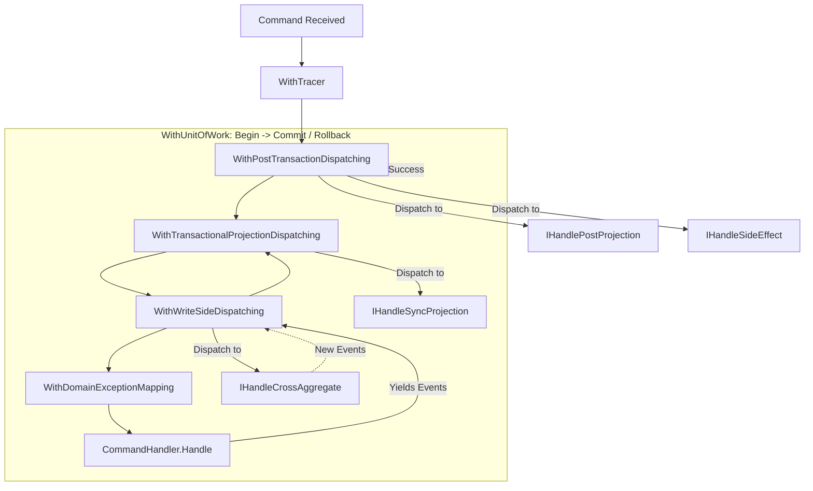

# Requirements

### Overview & Goals
HerrGeneral currently executes all command processing, aggregate modifications, write-side event handlers, and read-side projection handlers inside a single synchronous `IUnitOfWork` transaction. The goal of this change is to evolve the handler taxonomy and command pipeline to provide clear, dedicated handler abstractions categorized by their operational intent and transactional boundary:

1. **Modification of other aggregates (In-Transaction)**: Modifies domain aggregates and yields new domain events within the active transaction.
2. **Modification of projections (In-Transaction)**: Synchronously updates read models or outbox tables inside the active transaction before commit (fails the transaction if projection update fails).
3. **Modification of projections (Post-Transaction)**: Updates eventual consistency read models and views after successful transaction commit.
4. **Triggering side-effects (Post-Transaction)**: Executes fire-and-forget or external integrations (emails, notifications, external message buses, void handlers) strictly after the transaction commits successfully.

### Scope
- **In Scope**:
  - Introduction of dedicated, unified handler contracts sharing the common `IHandle...` prefix:
    - `IHandleCrossAggregate<in TEvent, TAggregate>` (In-Transaction: aggregate modification & event generation).
    - `IHandleSyncProjection<in TEvent>` (In-Transaction: synchronous read model updates within the transaction).
    - `IHandlePostProjection<in TEvent>` (Post-Transaction: eventual consistency read model updates post-commit).
    - `IHandleSideEffect<in TEvent>` (Post-Transaction: fire-and-forget side effects & external integrations post-commit).
  - Backward compatibility aliases / adapters for existing contracts (`ICrossAggregateChangeHandler`, `IProjectionEventHandler`).
  - Pipeline restructuring in `CommandHandlerPipeline` and `CommandHandlerWrapperBase` to sequence handlers accurately across `WithUnitOfWork.Commit()`.
  - Dispatcher support for transactional projections (`IHandleSyncProjection`) and post-transaction executions (`IHandlePostProjection`, `IHandleSideEffect`).
  - Tracing and error isolation for post-transaction executions.
  - Assembly scanning and registration policies in `HerrGeneral.Core` and `HerrGeneral.Core.DDD`.
  - Comprehensive documentation update: updating the root `README.md`, individual package README files, XML documentation comments on all handler contracts and pipeline extensions, and updating `CHANGELOG.md`.
- **Out of Scope**:
  - Asynchronous background job schedulers or distributed queue implementations (e.g., Hangfire/RabbitMQ); the framework coordinates synchronous in-process post-commit execution while allowing consumers to push to external queues from their side-effect handlers.

### User Stories
- **As a Domain Developer**, I want to trigger external side-effects (e.g., send confirmation email, publish message to Kafka) only when the database transaction has successfully committed, so that side-effects are never triggered for rolled-back operations.
- **As a Read-Side Developer**, I want the option to update critical projection tables inside the transaction (strict consistency) or after the transaction (eventual consistency) based on my performance and consistency requirements.
- **As an Application Developer**, I want a handler interface that returns `void` and produces no events for post-transaction actions without needing to return dummy empty lists.

### Functional Requirements
- **FR-1**: When an event is published from a command or aggregate, any registered `IHandleCrossAggregate<in TEvent, TAggregate>` (or `ICrossAggregateChangeHandler`) must execute inside the transaction and persist affected aggregates.
- **FR-2**: Registered `IHandleSyncProjection<in TEvent>` instances must execute inside the transaction prior to `unitOfWork.Commit()`. If an exception occurs, the transaction must roll back.
- **FR-3**: Registered `IHandlePostProjection<in TEvent>` and `IHandleSideEffect<in TEvent>` instances must execute only after `unitOfWork.Commit()` succeeds.
- **FR-4**: If a post-transaction side-effect (`IHandleSideEffect`) or post-transaction projection (`IHandlePostProjection`) throws an exception, the already-committed transaction must remain valid, the error must be captured by `CommandExecutionTracer`, and the command's primary `Result` must reflect domain success.
- **FR-5**: Handlers must be automatically discoverable via `ConfigurationBuilder.Scan...` and configurable via manual mappings.
- **FR-6**: Public interfaces, pipeline extension methods, and DI configuration methods must include clear XML documentation, and repo/package READMEs must be updated with handler taxonomy guides, diagrams, and code samples.

### Non-Functional Requirements
- **Transaction Safety**: Guaranteed isolation between domain persistence and uncommitted side-effects.
- **Developer Ergonomics**: Clear, unambiguous interface names communicating execution semantics at compile time.
- **Backward Compatibility**: Existing command and domain handlers remain fully supported.

# Technical Design

### Current Implementation
In the current architecture:
- `CommandHandlerWrapperBase` composes:
  `Start(handler).WithDomainExceptionMapping(...).WithWriteSideDispatching(...).WithReadSideDispatching(...).WithUnitOfWork(...).WithTracer(...)`
- `WithUnitOfWork` wraps the inner execution with `unitOfWork.Start()`, `unitOfWork.Commit()`, and `unitOfWork.RollBack()`.
- `WriteSideEventDispatcher` dispatches events to `IEventHandler<TEvent>` (adapted for `IDomainEventHandler`, `ICrossAggregateChangeHandler`, `IVoidDomainEventHandler`).
- `ReadSideEventDispatcher` dispatches events to `IProjectionEventHandler<TEvent>`.
- All handlers execute inside the transaction before commit.

### Key Decisions
1. **Pipeline Restructuring**:
   - Move post-transaction execution (`IHandlePostProjection`, `IHandleSideEffect`) outside `WithUnitOfWork`.
   - Maintain write-side aggregate dispatching (`IHandleCrossAggregate`) and synchronous projections (`IHandleSyncProjection`) inside `WithUnitOfWork`.
2. **Unified `IHandle...` Taxonomy for High Ergonomics and Fast Autocompletion**:
   - `IHandleCrossAggregate<in TEvent, TAggregate>`: Mutates another aggregate, returns changes/events, in-transaction.
   - `IHandleSyncProjection<in TEvent>`: Void, updates projection/outbox synchronously in-transaction (fails tx on error).
   - `IHandlePostProjection<in TEvent>`: Void, updates projections post-transaction after commit.
   - `IHandleSideEffect<in TEvent>`: Void, triggers external side-effects post-transaction.
3. **Error Isolation Policy**:
   - In-transaction errors trigger `RollBack()`.
   - Post-transaction errors are traced and logged via `CommandExecutionTracer` without altering the committed state or masking domain success.

### Architecture Diagram


### Data Models / Contracts

```csharp
namespace HerrGeneral;

/// <summary>
/// Defines a handler that executes post-transaction side-effects (e.g. notifications, emails, external message bus).
/// Executes strictly after the database transaction has committed.
/// </summary>
/// <typeparam name="TEvent">The type of event being handled.</typeparam>
public interface IHandleSideEffect<in TEvent>
{
    void Handle(TEvent @event);
}

/// <summary>
/// Defines a projection handler executed post-transaction after the database transaction has committed.
/// </summary>
/// <typeparam name="TEvent">The type of event being handled.</typeparam>
public interface IHandlePostProjection<in TEvent>
{
    void Handle(TEvent @event);
}

/// <summary>
/// Defines a projection handler executed within the active transaction before commit.
/// Fails and rolls back the transaction if projection update fails.
/// </summary>
/// <typeparam name="TEvent">The type of event being handled.</typeparam>
public interface IHandleSyncProjection<in TEvent>
{
    void Handle(TEvent @event);
}
```

```csharp
namespace HerrGeneral.WriteSide.DDD;

/// <summary>
/// Defines a cross-aggregate handler executed within the active transaction to modify another aggregate.
/// </summary>
/// <typeparam name="TEvent">The type of event being handled.</typeparam>
/// <typeparam name="TAggregate">The aggregate type being modified.</typeparam>
public interface IHandleCrossAggregate<in TEvent, TAggregate> where TAggregate : IAggregate
{
    ChangeRequests<TAggregate> Handle(TEvent @event);
}
```

### Components & File Structure
- **HerrGeneral.Core / HerrGeneral.SideEffects**:
  - `IHandleSideEffect<TEvent>`: Interface definition for post-commit side-effects.
- **HerrGeneral.ReadSide**:
  - `IHandleSyncProjection<TEvent>`: In-transaction projection interface.
  - `IHandlePostProjection<TEvent>`: Post-transaction projection interface (aliased/compatible with `IProjectionEventHandler<TEvent>`).
- **HerrGeneral.WriteSide.DDD**:
  - `IHandleCrossAggregate<TEvent, TAggregate>`: Cross-aggregate mutation interface.
- **HerrGeneral.Core**:
  - `Core/SideEffects/SideEffectEventDispatcher.cs`: Dispatcher for `IHandleSideEffect`.
  - `Core/ReadSide/TransactionalProjectionEventDispatcher.cs`: Dispatcher for `IHandleSyncProjection`.
  - `Core/ReadSide/PostProjectionEventDispatcher.cs`: Dispatcher for `IHandlePostProjection`.
  - `Core/Command/CommandHandlerPipeline.cs`: Updated with `WithPostTransactionDispatching` and `WithTransactionalProjectionDispatching`.
  - `Core/Command/CommandHandlerWrapperBase.cs`: Updated decorator assembly order.
  - `Core/Registration/Policy/RegisterIHandleSideEffect.cs`: DI registration policy for side-effect handlers.
  - `Core/Registration/Policy/RegisterIHandleSyncProjection.cs`: DI registration policy for sync projection handlers.
  - `Core/Registration/Policy/RegisterIHandlePostProjection.cs`: DI registration policy for post projection handlers.
  - `ConfigurationBuilder.cs`: Added `ScanSideEffectsOn(...)`, `ScanSyncProjectionsOn(...)`, `ScanPostProjectionsOn(...)`.

### Error Handling & Tracing
- `CommandExecutionTracer`:
  - `StartPublishEventsOnSideEffects(int count)`
  - `PublishEventOnSideEffects(object event)`
  - `HandleSideEffectEvent(Type handlerType)`
  - `OnSideEffectException(Exception ex)`
- Failures during post-transaction dispatching are caught and traced without throwing out of the command result if isolation is active.

### Documentation Updates
- **Root `README.md`**:
  - Update the Command Processing Flow diagram to illustrate the transaction boundary (`WithUnitOfWork`) and the four handler execution phases (`IHandleCrossAggregate` -> `IHandleSyncProjection` -> Commit -> `IHandlePostProjection` / `IHandleSideEffect`).
  - Add a Decision Matrix / Guide explaining when to choose each of the four handler types based on consistency and side-effect needs.
  - Update DI registration code samples showcasing `UseHerrGeneral` with the new scanning and manual mapping methods.
- **Package READMEs**:
  - `src/HerrGeneral.Core/README.md`: Document `IHandleSideEffect`, `IHandleSyncProjection`, `IHandlePostProjection`, registration policies, and pipeline decorators.
  - `src/HerrGeneral.ReadSide/README.md`: Document projection handlers and the distinction between synchronous in-transaction vs eventual post-transaction read models.
  - `src/HerrGeneral.WriteSide.DDD/README.md` and `src/HerrGeneral.Core.DDD/README.md`: Document `IHandleCrossAggregate` for in-transaction aggregate orchestration.
- **XML Documentation**:
  - Add full triple-slash XML comments on all new interfaces, methods, and delegates detailing execution phase, transaction context, and error handling behavior.
- **`CHANGELOG.md`**:
  - Document the new handler types, pipeline changes, and migration/upgrade path.

# Testing

### Validation Approach
Verification will be conducted using automated unit and integration tests with xUnit, NSubstitute, and FluentAssertions, simulating transactional contexts using `IUnitOfWork` test doubles.

### Key Scenarios
1. **In-Transaction Aggregate Modification**:
   - Command generates `EventA`.
   - `IHandleCrossAggregate<EventA, BankAccount>` handles `EventA`, modifies `AggregateB`, and generates `EventB`.
   - `unitOfWork.Commit()` is called only after all cascading aggregate modifications complete.
2. **In-Transaction Projection Rollback**:
   - Command generates `EventA`.
   - `IHandleSyncProjection<EventA>` throws an exception.
   - Assert `unitOfWork.RollBack()` is called and transaction is not committed.
   - Assert post-transaction handlers and side-effects are NEVER called.
3. **Post-Transaction Side-Effect and Projection Execution**:
   - Command completes successfully.
   - `unitOfWork.Commit()` is verified to have executed BEFORE `IHandleSideEffect.Handle()` and `IHandlePostProjection.Handle()` are called.
   - `IHandleSideEffect` and `IHandlePostProjection` receive events and execute without generating new domain events.
4. **Post-Transaction Side-Effect Failure Isolation**:
   - `IHandleSideEffect` throws an exception (e.g. SMTP timeout).
   - Assert `unitOfWork.Commit()` was already executed and is not rolled back.
   - Assert the exception is recorded in `CommandExecutionTracer`.
   - Assert the command `Result` is successful.

### Edge Cases
- Command produces no events -> post-transaction and in-transaction dispatchers return immediately with no-op.
- Multiple side-effect handlers registered for the same event -> all executed in sequence.
- Cascading domain events produced across multiple aggregates -> all accumulated and dispatched to post-transaction handlers in FIFO order after commit.

### Test Changes
- Add `HandleSideEffectTests.cs` in `HerrGeneral.Tests`.
- Add `HandleSyncProjectionTests.cs` in `HerrGeneral.Tests`.
- Add `HandlePostProjectionTests.cs` in `HerrGeneral.Tests`.
- Add `PipelineExecutionOrderTests.cs` validating the exact sequence:
  `Start -> WithTracer -> WithPostTx -> WithUnitOfWork -> WithTxProj -> WithWriteSide -> Handler -> WriteSideDispatch -> TxProjDispatch -> UoW.Commit -> PostTxDispatch (IHandlePostProjection & IHandleSideEffect)`.

# Delivery Steps

### ✓ Step 1: Define IHandle... handler interfaces and registration policies for all execution categories
New handler contracts with the unified `IHandle...` prefix and DI registration policies are available across the library packages.

- Define `IHandleSideEffect<in TEvent>` for void, post-transaction side effects.
- Define `IHandlePostProjection<in TEvent>` for post-transaction read model updates.
- Define `IHandleSyncProjection<in TEvent>` for synchronous in-transaction projections.
- Define `IHandleCrossAggregate<in TEvent, TAggregate>` for in-transaction aggregate modifications.
- Implement registration policies (`RegisterIHandleSideEffect`, `RegisterIHandlePostProjection`, `RegisterIHandleSyncProjection`, `RegisterIHandleCrossAggregate`) and wire them into `Scanner` and `RegistrationPolicyProvider`.
- Update `ConfigurationBuilder` to support assembly scanning and manual mappings for the new `IHandle...` interfaces.

### ✓ Step 2: Implement pipeline decorators and dispatchers for in-transaction vs post-transaction phases
The command pipeline orchestrates in-transaction and post-transaction dispatchers around UnitOfWork boundaries.

- Create `PostTransactionEventDispatcher` to dispatch post-commit events to `IHandleSideEffect` and `IHandlePostProjection`.
- Create `TransactionalProjectionEventDispatcher` (or integrate into write-side pipeline) to dispatch events to `IHandleSyncProjection` inside the transaction before `Commit()`.
- Add `WithPostTransactionDispatching` extension method to `CommandHandlerPipeline` positioned outside `WithUnitOfWork`.
- Update `WithWriteSideDispatching` and `WithTransactionalProjectionDispatching` inside `WithUnitOfWork` to guarantee proper execution sequencing.
- Update `CommandHandlerWrapperBase` and `CommandHandlerWrapper` to assemble the new pipeline order.

### ✓ Step 3: Integrate CommandExecutionTracer, exception handling, and ConfigurationBuilder support
Execution tracing and exception handling properly isolate post-transaction failures without compromising committed data.

- Update `CommandExecutionTracer` to trace `IHandleSyncProjection`, `IHandlePostProjection`, and `IHandleSideEffect` handlers with dedicated trace events.
- Implement error isolation in `PostTransactionEventDispatcher` to catch, trace, and log exceptions from side effects while preserving the successful `Result`.
- Ensure domain and panic exceptions thrown within in-transaction handlers (`IHandleCrossAggregate`, `IHandleSyncProjection`) trigger `unitOfWork.RollBack()` and propagate as expected.
- Expose configuration toggles and scanning methods in `ConfigurationBuilder` (e.g., `ScanSideEffectsOn`, `ScanSyncProjectionsOn`, `ScanPostProjectionsOn`).

### ✓ Step 4: Add comprehensive automated tests for transactional boundaries, side-effects, and execution order
Unit and integration tests validate execution order, transactional rollback guarantees, and side-effect isolation.

- Write unit tests verifying that `IHandleSyncProjection` failures trigger `unitOfWork.RollBack()`.
- Write unit tests verifying that `IHandleSideEffect` and `IHandlePostProjection` execute strictly after `unitOfWork.Commit()` and do not affect the transaction upon failure.
- Write tests validating the recursion and FIFO execution order when modifying other aggregates via `IHandleCrossAggregate` in-transaction.
- Add integration tests covering end-to-end command execution combining all four `IHandle...` handler types in a single flow.

### ✓ Step 5: Update documentation, package READMEs, and XML code comments
Root documentation, package READMEs, and XML comments thoroughly guide consumers on the handler taxonomy and pipeline execution model.

- Update root `README.md` with the updated ASCII/mermaid command processing flow highlighting the `WithUnitOfWork` boundary.
- Add a handler selection matrix in `README.md` detailing when to use `IHandleCrossAggregate`, `IHandleSyncProjection`, `IHandlePostProjection`, and `IHandleSideEffect`.
- Update package READMEs (`HerrGeneral.Core`, `HerrGeneral.ReadSide`, `HerrGeneral.WriteSide.DDD`, `HerrGeneral.Core.DDD`) with targeted code samples and registration instructions.
- Ensure all public interfaces, dispatchers, and pipeline extension methods have complete XML documentation comments.
- Update `CHANGELOG.md` with detailed release notes and migration guides.