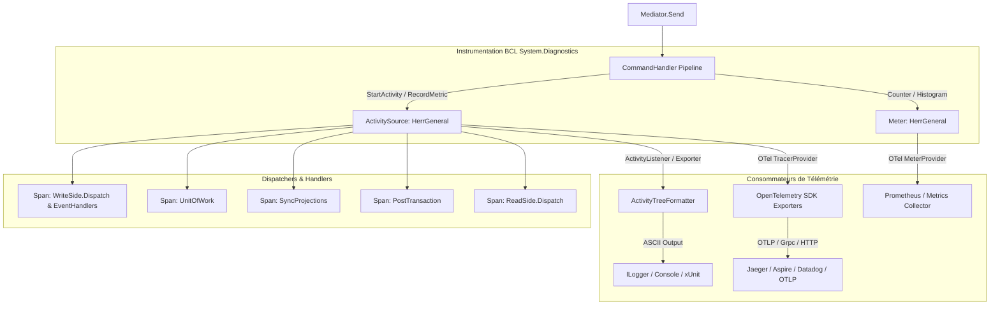

# Requirements

### Overview & Goals
L'objectif de cette étude et de ce plan est d'introduire le support natif d'**OpenTelemetry** (Distributed Tracing, Metrics et Structured Logs) dans la bibliothèque CQRS **HerrGeneral**, tout en étudiant la faisabilité et le design permettant de remplacer intégralement le système de log existant (`CommandExecutionTracer`) par un rendu textuel arborescent strictement équivalent.

### Scope
- **In Scope**:
  - Analyse de l'instrumentation native .NET via `System.Diagnostics.ActivitySource` (Traces) et `System.Diagnostics.Metrics.Meter` (Métriques) dans `HerrGeneral.Core`.
  - Étude du remplacement complet de `CommandExecutionTracer` et `CommandTracerSection` par un formateur basé sur les `Activity`.
  - Conservation de l'expérience développeur existante (rendu console et xUnit formaté en bloc ASCII hiérarchique).
  - Intégration avec le SDK OpenTelemetry .NET standard (`OpenTelemetry.Trace`, `OpenTelemetry.Metrics`, OTLP exporter, etc.).
  - Mise à jour de `HerrGeneral.SampleApplication`, `HerrGeneral.Test.Extension` et des tests unitaires (`TracingShould.cs`).
- **Out of Scope**:
  - Modification de la logique métier CQRS, du partitionnement ou du locking des agrégats.
  - Dépendances externes obligatoires imposées aux consommateurs qui n'utilisent pas OpenTelemetry (l'instrumentation BCL `System.Diagnostics` reste autonome et sans coût si non écoutée).

### User Stories
- **En tant que développeur utilisant HerrGeneral en production**, je veux exporter les traces et métriques de mes commandes et événements CQRS vers un backend APM standard (OpenTelemetry / Jaeger / Prometheus / Aspire Dashboard / Datadog) afin d'obtenir une observabilité distribuée de bout en bout.
- **En tant que développeur exécutant des tests ou en environnement local**, je veux conserver la lisibilité du résumé textuel d'exécution de commande (ASCII tree) dans mes logs console ou xUnit sans overhead inutile ni duplication de code de traçage.

### Functional Requirements
- **Traces distribuées (Spans)** :
  - Chaque commande (`Mediator.Send`) crée une activité racine (`HerrGeneral.ExecuteCommand`) avec son nom, son type, l'identifiant et type de l'agrégat, le résultat (succès/échec) et la durée.
  - Chaque étape du pipeline CQRS génère des sous-activités (activités enfants) :
    - `WriteSide.Dispatch` & `WriteSide.HandleEvent` (avec le type d'événement et le handler).
    - `UnitOfWork.Execute` (avec les opérations Start, Commit, Rollback, Dispose).
    - `SyncProjections.Dispatch` & `SyncProjections.HandleEvent`.
    - `PostTransaction.Dispatch` & `PostTransaction.HandleEvent`.
    - `ReadSide.Dispatch` & `ReadSide.HandleEvent`.
  - Les exceptions capturées doivent être enregistrées sur l'activité (`Activity.RecordException`) avec le statut d'erreur.
- **Métriques** :
  - Compteurs de commandes exécutées (`herrgeneral.commands.total` avec tags `command_name`, `status`).
  - Histogramme des temps d'exécution (`herrgeneral.commands.duration`).
  - Compteurs et histogrammes d'événements dispatchés (`herrgeneral.events.total`, `herrgeneral.events.duration`).
  - Jauge / UpDownCounter du nombre de commandes en cours d'exécution.
- **Rendu équivalent du système de log** :
  - Remplacer le `CommandExecutionTracer` par un formateur basé sur l'arbre d'activités produit par `ActivitySource`.
  - Le texte généré doit reproduire la structure actuelle :
    ```
    <------------------- CreateBankAccount thread<1> ------------------->
    -> Handled by CreateBankAccountHandler
    || Publish Write Side on thread<1>
          BankAccountCreated
          -> Handle by BankAccountCreatedHandler
    Start Unit of Work
    Commit Unit of Work
    Dispose Unit of Work
    || Publish Sync Projections (1 event) on thread<1>
          BankAccountCreated
          -> Handle sync projection by BankAccountProjectionHandler
    || Publish Post Transaction (1 event) on thread<1>
          BankAccountCreated
          -> Handle side-effect by SendWelcomeEmailHandler
    || Publish Read Side (1 event) on thread<1>
          BankAccountCreated
          -> Handle by AccountProjection
    <------------------- CreateBankAccount Finished 00:00:00.0123456 -------------------/>
    ```
  - La désactivation via `configuration.EnableCommandExecutionTracing(false)` doit désactiver le formatage/log textuel sans impacter la collecte télémétrique si un collecteur externe est branché.

### Non-Functional Requirements
- **Zéro allocation inutile (Zero-overhead principle)** : Si aucun `ActivityListener` / exportateur OTel n'est enregistré et que le logging textuel est désactivé, `ActivitySource.StartActivity` retourne `null` immédiatement avec un coût quasi nul.
- **Zéro dépendance tierce dans `HerrGeneral.Core`** : `System.Diagnostics` fait partie intégrante du framework BCL .NET (inclus dans .NET 10 / net10.0). Le package core reste léger et sans dépendance vers les packages `OpenTelemetry.*`.
- **Compatibilité .NET 10 & C# 14** : Utilisation des API modernes de diagnostics .NET.

# Technical Design

### Current Implementation
Actuellement, le traçage dans HerrGeneral repose sur une approche ad-hoc :
1. **`CommandExecutionTracer.cs`** : Classe scopée (`AddScoped<CommandExecutionTracer>`) qui maintient une arborescence d'objets `CommandTracerSection` et un `Stopwatch`.
2. **Couplage fort dans le pipeline** : `CommandHandlerWrapper`, `WriteSideEventDispatcher`, `TransactionalProjectionEventDispatcher`, `PostTransactionEventDispatcher`, `ReadSideEventDispatcher`, `EventHandlerPipeline`, `ReadSidePipeline` et `UnitOfWorkTraceDecorator` injectent directement `CommandExecutionTracer` et appellent des méthodes impératives (`StartHandlingCommand`, `PublishEventOnWriteSide`, `StartUnitOfWork`, etc.).
3. **Génération de log monolithique** : À la fin de la commande, `commandExecutionTracer.BuildString()` reconstruit un gros bloc ASCII multiligne écrit via `ILogger.LogInformation("{Message}", ...)`.
4. **Limites actuelles** :
   - Pas d'export vers OpenTelemetry / OTLP / APM (Jaeger, Aspire, Datadog).
   - Pas de métriques (compteurs, temps d'attente sur les verrous de partition, durée des handlers).
   - Allocation de mémoire importante due à la construction des chaînes et des sections en mémoire même en production.

### Key Decisions
1. **Instrumentation du Core via les API BCL `System.Diagnostics` (`ActivitySource` & `Meter`)**
   - *Rationale* : Recommandation officielle de Microsoft et OpenTelemetry pour les bibliothèques .NET. `HerrGeneral.Core` n'a pas besoin de référencer `OpenTelemetry` SDK ; il expose une `ActivitySource` ("HerrGeneral") et un `Meter` ("HerrGeneral"). Les applications consommatrices peuvent brancher le SDK OpenTelemetry ou utiliser des écouteurs natifs.
2. **Remplacement complet de `CommandExecutionTracer` par un modèle unifié basé sur `Activity`**
   - *Rationale* : L'arbre des spans d'une `Activity` racine et de ses enfants représente exactement la même hiérarchie que les sections de `CommandExecutionTracer`.
   - *Rendu équivalent* : Un composant dédié `ActivityTreeFormatter` (ou `HerrGeneralConsoleFormatter`) écoute la fin de l'activité racine de la commande et génère le bloc ASCII identique à l'existant.
3. **Séparation claire de l'instrumentation et de l'exportation**
   - *Rationale* : Le traçage (création des spans/métriques) est découplé de la façon dont les données sont affichées (Console, xUnit, OTLP).
4. **Conservation intégrale du modèle d'étapes de pipeline (`WithTracer` / `WithTracing`)**
   - *Rationale* : L'approche par composition de middleware/pipeline fonctionnel (`extension (HandlerDelegate next)`) est le cœur architectural de `HerrGeneral`. L'étape `WithTracer` (ou `WithTracing`) reste l'étape enveloppante qui gère le cycle de vie de l'activité (`Activity`), la capture des métriques et le déclenchement de l'export/logging, sans aucune intrusion dans le code métier ou les handlers. De même, les étapes `WithTracer` dans `EventHandlerPipeline` et `ReadSidePipeline` ainsi que `UnitOfWorkTraceDecorator` conservent leur rôle de décorateurs de pipeline pour les sous-activités.

### Architecture Diagram


### Proposed Changes
1. **`HerrGeneral.Core`** :
   - Ajouter `Diagnostics/HerrGeneralDiagnostics.cs` contenant :
     - `public static readonly ActivitySource ActivitySource = new("HerrGeneral", ...);`
     - `public static readonly Meter Meter = new("HerrGeneral", ...);`
     - Définition des compteurs : `CommandsTotal`, `CommandsDuration`, `EventsDispatchedTotal`, `EventsDuration`, `ActiveCommands`.
   - **Conservation et évolution des étapes de pipeline (`WithTracer`)** :
     - `CommandPipeline.WithTracer` (ou `WithTracing`) : Reste l'étape englobante de premier niveau dans `CommandHandlerWrapperBase.BuildPipeline`. Elle démarre l'activité racine `HerrGeneral.ExecuteCommand`, mesure la durée, enregistre les métriques `CommandsTotal`/`CommandsDuration`, intercepte les exceptions pour les marquer sur l'activité (`activity.RecordException`), et déclenche le rendu ASCII/Log à la complétion si le logging est activé.
     - `EventHandlerPipeline.WithTracer` : Reste l'étape de pipeline par handler d'événement, créant la sous-activité `HerrGeneral.Event.Handle` avec le type d'événement et le handler.
     - `ReadSidePipeline.WithReadSideHandlerLogging` (ou `WithTracer`) : Conserve l'étape de pipeline pour les projections read side.
     - `UnitOfWorkTraceDecorator` : Conserve le motif de décorateur de pipeline pour tracer `Start`, `Commit`, `Rollback` et `Dispose`.
   - Supprimer `CommandTracerSection.cs` et refactorer / déprécier `CommandExecutionTracer.cs`.
   - Créer `Diagnostics/ActivityTreeFormatter.cs` pour convertir un graphe d'activités en chaîne de caractères ASCII identique au format actuel.
   - Créer `Diagnostics/HerrGeneralTraceLogger.cs` (ou écouteur scoped) activé lorsque `configuration.IsTracingEnabled` est vrai pour émettre le log formaté sur `ILogger`.

2. **`HerrGeneral.Test.Extension`** :
   - Mettre à jour `AddHerrGeneralTestLogger` pour configurer le formateur d'activités vers `ITestOutputHelper`.

3. **`HerrGeneral.OpenTelemetry` (Nouveau package ou extension optionnelle)** :
   - Fournir les méthodes d'extension :
     - `TracerProviderBuilder.AddHerrGeneralInstrumentation(this TracerProviderBuilder builder)`
     - `MeterProviderBuilder.AddHerrGeneralInstrumentation(this MeterProviderBuilder builder)`

### Data Models & Contracts
```csharp
public static class HerrGeneralDiagnostics
{
    public const string ActivitySourceName = "HerrGeneral";
    public const string MeterName = "HerrGeneral";
    
    public static readonly ActivitySource ActivitySource = new(ActivitySourceName, typeof(HerrGeneralDiagnostics).Assembly.GetName().Version?.ToString() ?? "1.0.0");
    public static readonly Meter Meter = new(MeterName, typeof(HerrGeneralDiagnostics).Assembly.GetName().Version?.ToString() ?? "1.0.0");

    // Metrics
    public static readonly Counter<long> CommandsTotal = Meter.CreateCounter<long>("herrgeneral.commands.total", description: "Total number of executed commands");
    public static readonly Histogram<double> CommandsDuration = Meter.CreateHistogram<double>("herrgeneral.commands.duration", unit: "ms", description: "Duration of command executions");
    public static readonly Counter<long> EventsTotal = Meter.CreateCounter<long>("herrgeneral.events.total", description: "Total number of dispatched events");
    public static readonly UpDownCounter<int> ActiveCommands = Meter.CreateUpDownCounter<int>("herrgeneral.commands.active", description: "Number of currently executing commands");
}

public static class ActivityTreeFormatter
{
    public static string Format(Activity commandActivity, IReadOnlyList<Activity> childActivities);
}
```

### Risks & Mitigations
- **Risque de régression visuelle sur les tests xUnit ou les logs existants** :
  - *Atténuation* : `ActivityTreeFormatter` sera validé par des tests unitaires comparant directement la sortie produite avec la sortie actuelle de `CommandExecutionTracer`.
- **Performance / allocations si la télémétrie n'est pas activée** :
  - *Atténuation* : `ActivitySource.StartActivity` vérifie en interne si des `ActivityListener` sont enregistrés. S'il n'y en a pas, aucun objet `Activity` n'est alloué (retourne `null`).

# Testing

### Validation Approach
La validation de l'introduction d'OpenTelemetry et du remplacement du système de log se fera à travers :
1. **Tests de conformité du rendu textuel (Régression visuelle)** :
   - Comparaison de la chaîne ASCII générée pour des commandes simples, complexes (Write-Side, UoW, Sync Projections, Post-Tx, Read-Side) et en cas d'erreur/exception.
2. **Tests d'observabilité OpenTelemetry** :
   - Enregistrement d'un `ActivityListener` de test pour vérifier la hiérarchie des spans (Parent/Child IDs), les tags sémantiques, le statut d'erreur et les événements.
   - Enregistrement d'un `MeterListener` pour vérifier l'incrémentation des compteurs et l'enregistrement des durées dans les histogrammes.
3. **Tests de non-régression de la suite de tests existante** :
   - Exécution de l'intégralité des tests de `HerrGeneral.Test` (notamment `TracingShould.cs`, `PipelineExecutionOrderTests.cs`, etc.).

### Key Scenarios
- **Scénario 1 : Exécution complète d'une commande nominale**
  - Vérifier la création de la span racine avec son nom de commande et son handler.
  - Vérifier la création ordonnée des sous-spans : WriteSide -> UnitOfWork -> SyncProjections -> PostTransaction -> ReadSide.
  - Vérifier que le formateur textuel produit le bloc ASCII attendu avec les bons niveaux d'indentation et les durées.
- **Scénario 2 : Échec avec DomainException / Exception générique**
  - Vérifier que la span correspondante passe en statut `ActivityStatusCode.Error` et contient l'exception (`activity.RecordException`).
  - Vérifier que le rendu textuel inclut la mention de l'exception avec l'indentation adéquate.
- **Scénario 3 : Désactivation du traçage (`EnableCommandExecutionTracing(false)`)**
  - Vérifier qu'aucun log textuel n'est émis sur `ILogger` lorsque le flag est désactivé.
- **Scénario 4 : Collecte des métriques**
  - Vérifier que `herrgeneral.commands.total` s'incrémente avec le tag `command.name` et `status="Success"`.
  - Vérifier que `herrgeneral.commands.duration` enregistre une valeur strictement positive.

# Delivery Steps

### ✓ Step 1: 1. Instrumenter HerrGeneral.Core avec System.Diagnostics (ActivitySource et Meter)
Poser les fondations de l'observabilité dans `HerrGeneral.Core` en utilisant les API standards BCL sans dépendance tierce lourde.

- Créer `HerrGeneralDiagnostics.cs` dans `HerrGeneral.Core` contenant `ActivitySource` ("HerrGeneral") et `Meter` ("HerrGeneral").
- Définir les constantes sémantiques pour les tags et métriques (`herrgeneral.command.name`, `herrgeneral.aggregate.id`, `herrgeneral.event.type`, `herrgeneral.handler.type`, `herrgeneral.command.duration`, etc.).
- Instrumenter `CommandHandlerWrapper` avec une activité racine représentant l'exécution de la commande, le suivi de la durée, et la capture des exceptions.
- Instrumenter les dispatchers (`WriteSideEventDispatcher`, `TransactionalProjectionEventDispatcher`, `PostTransactionEventDispatcher`, `ReadSideEventDispatcher`) et `UnitOfWorkTraceDecorator` avec des activités enfants et des métriques de comptage/latence.

### ✓ Step 2: 2. Remplacer CommandExecutionTracer par un formateur basé sur Activity
Développer le moteur de rendu arborescent basé sur les `Activity` pour reproduire à l'identique la sortie console et xUnit actuelle.

- Créer `ActivityTreeFormatter` qui reconstruit et formate la hiérarchie des activités et événements d'une commande sous forme de bloc ASCII identique à l'existant.
- Créer un `ActivityListener` / exportateur léger capable d'intercepter la fin de l'activité racine de commande et d'émettre le rendu ASCII vers `ILogger` ou `Console`.
- Adapter `HerrGeneral.Test.Extension` pour supporter ce formateur avec `ITestOutputHelper` de xUnit.
- Supprimer ou déprécier les anciennes classes monolithiques `CommandExecutionTracer` et `CommandTracerSection` tout en maintenant la rétrocompatibilité des options de configuration (`EnableCommandExecutionTracing`).

### ✓ Step 3: 3. Intégration OpenTelemetry SDK, Sample Application et Validation des Tests
Offrir une intégration fluide avec l'écosystème OpenTelemetry .NET et mettre à jour la documentation et l'application d'exemple.

- Créer l'extension d'enregistrement OpenTelemetry (`TracerProviderBuilder.AddHerrGeneralInstrumentation()`, `MeterProviderBuilder.AddHerrGeneralInstrumentation()`) optionnellement dans un package dédié ou intégré.
- Mettre à jour `HerrGeneral.SampleApplication` pour démontrer à la fois l'export OpenTelemetry (console / OTLP) et le rendu ASCII équivalent.
- Mettre à jour et enrichir la suite de tests (`TracingShould.cs`, tests de propagation de contexte et de métriques).
- Mettre à jour le fichier `README.md` et `CHANGELOG.md` avec la documentation sur OpenTelemetry et la migration du système de tracing.