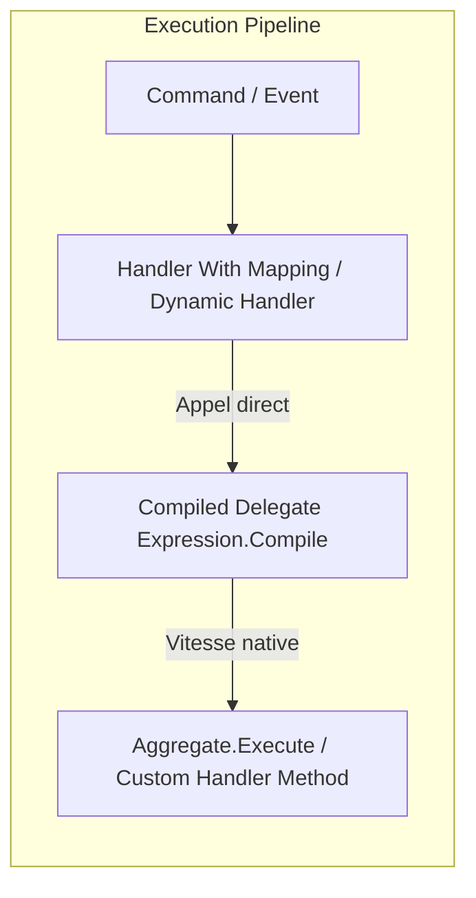

---
sessionId: session-260903-214200-1jyy
---

# Requirements

### Overview & Goals
Le projet utilise actuellement la réflexion tardive (`MethodInfo.Invoke`, `GetMethods()`, `Activator.CreateInstance`) sur plusieurs chemins critiques d'exécution (exécution de commandes dynamiques, handlers mappés, instanciation des wrappers et fabriques d'agrégats).
L'objectif est d'éliminer ce surcoût d'exécution et ces allocations en remplaçant la réflexion à l'exécution par des **expressions compilées en mémoire (`System.Linq.Expressions`)** et des délégués fortement typés mis en cache statiquement.

### Scope
- **In Scope** :
  - `HerrGeneral.Core.DDD` : `ChangeHandlerByReflection<TAggregate, TCommand>` et `DefaultAggregateFactory<TAggregate>`.
  - `HerrGeneral.Core` : `CommandHandlerWithMapping<TCommand, THandler, TResult>`, `EventHandlerWithMapping<TEvent, THandler>`, `ProjectionEventHandlerWithMapping<TEvent, THandler>`.
  - `HerrGeneral.Core` : Résolution/instanciation des wrappers dans `Mediator`, `WriteSideEventDispatcher`, `ReadSideEventDispatcher`.
  - Caching des délégués compilés pour garantir une exécution à vitesse quasi-native après le premier appel.
- **Out of Scope** :
  - Réécriture complète de la DI via des Roslyn Source Generators externes (le scan DI existant reste dynamique et fluide).
  - Modification des contrats publics (`ICommandHandler`, `IEventHandler`, `Mediator`).

### User Stories
- En tant que développeur utilisant `HerrGeneral`, je veux que l'exécution de mes commandes et événements soit aussi rapide qu'un appel de méthode direct, sans la latence ni les allocations dues à `MethodInfo.Invoke`.
- En tant que développeur utilisant les handlers dynamiques DDD, je veux que la création et modification d'agrégats sans handler explicite bénéficient de performances optimales.

### Functional Requirements
- Les signatures et comportements publics de l'API restent 100% rétrocompatibles.
- Les exceptions levées (`MissingMethodException`, `ConversionException`, exceptions de domaine) doivent conserver exactement la même sémantique et la même hiérarchie.
- Aucun changement requis dans le code consommateur (ex: tests, applications clientes).

### Non-Functional Requirements
- **Performance** : Temps d'invocation divisé par 10 à 50 sur les handlers dynamiques et mappés (vitesse équivalente à un délégué C# direct).
- **Allocations mémoire** : Suppression des allocations de tableaux d'arguments `object[]` nécessaires à `MethodInfo.Invoke`.

# Technical Design

### Current Implementation
Actuellement, la réflexion tardive intervient à plusieurs endroits clés :
1. `ChangeHandlerByReflection.Handle` : effectue un `GetMethods()` avec filtre LINQ puis `MethodInfo.Invoke(aggregate, [command])` à **chaque** exécution de commande sans mise en cache.
2. `DefaultAggregateFactory.Create` : appelle `Activator.CreateInstance` à chaque instanciation d'agrégat.
3. `CommandHandlerWithMapping.Handle` & `EventHandlerWithMapping.Handle` : invoquent la méthode métier via `handleMethod.Invoke(handler, [command/evt])`.
4. `Mediator`, `WriteSideEventDispatcher`, `ReadSideEventDispatcher` : construisent les types génériques et instancient les wrappers via `MakeGenericType` et `Activator.CreateInstance`.

### Key Decisions
- **Choix d'`Expression.Compile()` plutôt que Source Generators Roslyn** :
  - *Décision* : Utiliser des arbres d'expression compilés (`System.Linq.Expressions`) avec cache statique/dictionnaire concurrent.
  - *Raison* : Intégration transparente avec le système d'enregistrement dynamique et fluide existant (`ScanWriteSideOn`, `RegisterWriteSideEventHandlerWithMapping`), sans imposer de projet Roslyn Generator ni casser la flexibilité au runtime.
- **Délégation fortement typée** :
  - Compiler les méthodes cibles sous forme de délégués `Func<TAggregate, TCommand, TAggregate>`, `Func<Create<TAggregate>, Guid, TAggregate>`, et `Func<THandler, TInput, object>`.
- **Conservation de la gestion d'erreurs** :
  - Gérer l'absence de méthode/constructeur lors de la compilation initiale de l'expression et lever fidèlement `MissingMethodException`.

### Proposed Changes
1. **`ChangeHandlerByReflection<TAggregate, TCommand>`** :
   - Compiler et stocker un délégué statique `Func<TAggregate, TCommand, TAggregate>` généré via `Expression.Lambda`.
2. **`DefaultAggregateFactory<TAggregate>`** :
   - Compiler et mettre en cache la fabrique de constructeur `Func<Create<TAggregate>, Guid, TAggregate>` via `Expression.New`.
3. **`CommandHandlerWithMapping` / `EventHandlerWithMapping` / `ProjectionEventHandlerWithMapping`** :
   - Compiler les invocations `MethodInfo` en délégués exécutables directs pour supprimer les allocations de tableaux `[param]` et le dispatch de réflexion.
4. **`Mediator` & `Dispatchers`** :
   - Utiliser des fabriques de wrappers pré-compilées ou des classes génériques imbriquées pour éviter `Activator.CreateInstance`.

### Architecture Diagram

### Risks
- *Risque* : Le coût de compilation initiale (`Expression.Compile()`) lors du tout premier appel pour un type donné.
  * *Atténuation* : Ce coût n'est payé qu'une seule fois au premier passage (quelques millisecondes), puis amorti immédiatement sur toutes les exécutions suivantes qui tournent à vitesse native.
- *Risque* : Différence dans l'encapsulation des exceptions (`TargetInvocationException`).
  * *Atténuation* : Un délégué compilé propage directement l'exception réelle sans l'encapsuler dans une `TargetInvocationException`, simplifiant le code et éliminant le besoin de désencapsulation manuelle.

# Testing

### Validation Approach
La suite de tests automatisés xUnit (`HerrGeneral.Test` et `HerrGeneral.WriteSide.DDD.Test`) sera exécutée pour s'assurer qu'aucune régression fonctionnelle n'est introduite.

### Key Scenarios
- **Handlers dynamiques DDD (`DynamicHandlerShould`)** :
  - Exécution de commandes de création sans handler explicite (`HandleACreateCommandWithoutHandler`).
  - Exécution de commandes de modification sans handler explicite (`HandleAChangeCommandWithoutHandler`, `HandleASecondChangeCommandWithoutHandler`).
- **Handlers avec mapping personnalisé (`CommandHandlerWithMappingShould`, `EventHandlerWithMappingShould`, `SendWithMappingShould`)** :
  - Mapping avec retour de type `Unit`, valeur scalaire personnalisée, ou liste d'événements.
- **Dispatch d'événements ReadSide & WriteSide (`ReadSideEventDispatcherShould`, `EventHandlerMappersShould`)**.

### Edge Cases
- Commandes ciblant un agrégat sans méthode `Execute` correspondante : vérification de la levée de `MissingMethodException` encapsulée en `PanicException`.
- Commandes de création sans constructeur adéquat : vérification de la levée de `MissingMethodException`.
- Handlers mappés retournant `null` ou des types incompatibles (`ConversionException`).

# Delivery Steps

### ✓ Step 1: Optimisation des handlers dynamiques DDD et factories d'agrégats
Les invocations par réflexion dans `ChangeHandlerByReflection` et `DefaultAggregateFactory` sont remplacées par des délégués compilés en mémoire et mis en cache.

- Implémenter la compilation d'expression pour la méthode `Execute(TCommand)` dans `ChangeHandlerByReflection<TAggregate, TCommand>` via `Expression.Call` et `Expression.Lambda.Compile()`.
- Remplacer l'appel à `Activator.CreateInstance` dans `DefaultAggregateFactory<TAggregate>` par un constructeur compilé (`Expression.New`) mis en cache par type d'agrégat/commande.
- Préserver la levée exacte des exceptions attendues (`MissingMethodException`) pour maintenir la compatibilité avec les tests existants.

### ✓ Step 2: Remplacement de MethodInfo.Invoke dans les handlers mappés
Les méthodes des handlers conventionnels et mappés sont invoquées via des délégués compilés plutôt que via `MethodInfo.Invoke`.

- Mettre à jour `CommandHandlerWithMapping<TCommand, THandler, TResult>` pour compiler et réutiliser un délégué `Func<THandler, TCommand, object>` généré avec `Expression.Call`.
- Optimiser `EventHandlerWithMapping<TEvent, THandler>` et `ProjectionEventHandlerWithMapping<TEvent, THandler>` pour appeler la méthode cible via un délégué compilé `Func<THandler, TEvent, object?>` ou `Action<THandler, TEvent>`.
- Mettre en cache les délégués compilés dans `EventHandlerMappingsProvider` et `CommandHandlerMappings` pour éviter toute recompilation ultérieure.

### ✓ Step 3: Optimisation de l'instanciation des wrappers dans le Mediator et les Dispatchers
L'instanciation des wrappers de dispatching n'utilise plus `MakeGenericType` et `Activator.CreateInstance` à répétition.

- Optimiser la résolution et l'instanciation des wrappers dans `Mediator`, `WriteSideEventDispatcher` et `ReadSideEventDispatcher` en s'appuyant sur des factories compilées ou des classes génériques statiques (`GenericWrapperCache<T>`).
- Réduire les coûts de verrouillage et d'allocations liés aux dictionnaires concurrents sur les types déjà rencontrés.

### ✓ Step 4: Validation globale et tests de non-régression
L'ensemble de la suite de tests est validé avec succès sans régression fonctionnelle ni baisse de performance.

- Exécuter la suite complète de tests unitaires et d'intégration via `dotnet test HerrGeneral.slnx`.
- Vérifier la bonne gestion des cas limites (méthodes absentes, exceptions internes, types dérivés).
- Confirmer l'absence d'avertissements de compilation et de régression de build.